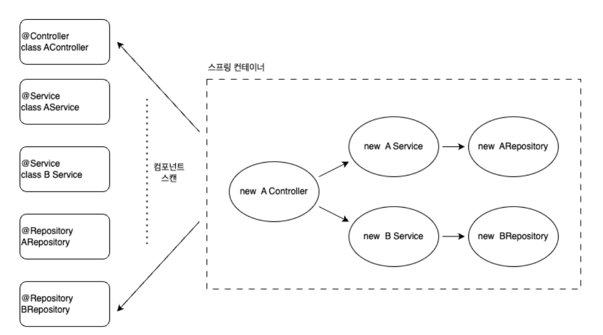

# 백엔드 - 기본 이론

## 🔍 Spring Framework : Java 웹 어플리케이션의 핵심

- spring은 전 세계적으로 널리 사용되는 웹 프레임워크이다
- 효율성,코드 품질,비용 절감 등의 다양한 장점이 있다. 
- 경량 컨테이너로 자바 객체를 직접 스프링 안에서 관리한다.
- 객체의 생성 및 소멸과 같은 생명 주기를 관리하며, 스프링 컨테이너에서 필요한 객체를 가져와 사용한다.

### 관점지향 프로그래밍(AOP)

- AOP는 OOP를 더욱 보완하고 확장한 개념,
- 하나의 소프트웨어가 하나의 거대한 OOP로써 설계, 프로그래밍 되었다면 이것을 각 기능별로 모듈화 해서 분리를 시키는 개념이다.
- 공통 모듈을 분리시켜 해당 소스코드가 외부의 다른 클래스에서 존재하는 것

### Spring의 IoC(Inversion of Control)
- 일반적인 의존성에 대한 제어권: 개발자가 직접 의존성을 만든다.
- Spring에서는 밖에서 나에게 의존성을 주입해주는 DI 기능을 제공해준다. 

### Bean
- 스프링 IoC 컨테이너가 관리하는 객체들을 **Bean**이라고 부름.
- 스프링은 이러한 Bean들의 의존성을 관리하고, 객체를 만들어 주며, Bean으로 등록을 해 주고, 이렇게 만들어진 것들을 관리
- 스프링에서이 의존성 주입은 반드시 Bean으로 등록된 객체 끼리만 가능

## 🔍 데이터베이스

여러 사람이 공유하여 사용할 목적으로 체계화해 통합, 관리하는 데이터 집합

### DBMS

- 데이터베이스를 저장하고 관리할 수 있는 응용 프로그램
- 각 DBMS들은 공통적인 특성을 가지면서도, 그 특성을 구현해내는 내부적인 방법은 다를
  수 있다! 
- 크게 관계형과 비관계형으로 나눌 수 있다.

**관계형 데이터베이스** 
가장 널리 쓰이는 데이터베이스이며, 데이터를 행과 열로 이루어진 표의 형태로 저장.
- 데이터를 테이블 형태로 저장
- 왜? 관계인가? 각 테이블의 행과 행이 연결되는 관계를 맺을 수 있기 때문이다. 일 대 일, 일 대 다, 다 대 다의 관계가 있다.
- 우리는 하나의 테이블에 필요한 모든 필드를 넣고 모든 데이터 항목을 저장한다면 중복해서 자장되는
상황이 발생해 비효율적이다!
-> 따라서 기본 키와 외래 키의 개념을 사용하여 테이블을 분리하고 관계를 형성해 효율적으로 데이터를 관리한다.

***대표적인 관계형 DBMS***
- Oracle Database: 오라클 사에서 만든 데이터베이스입니다. 막강한 성능과 안정성이 장점이지만 유료라는 단점
- MySQL
- PostgreSQL

**비관계형 데이터베이스**
관계형 데이터베이스를 제외한 모든 종류의 데이터베이스를 비관계형 데이터베이스라고 부릅니다. 키-값형, 문서형 등이 있다.

***대표적인 비관계형 DBMS***
-MongoDB : 문서형 데이터베이스/데이터를 비정형적으로 저장할 수 있다.
-Redis : Key-Value 스토어 데이터베이스/캐시 용도로 주로 사용

## 🔍 JPA: Java Persistence API의 약어로, 자바 ORM 기술의 표준 인터페이스

**ORM**이란?    
***Object Relational Mapping***의 약어로, 객체 관계 매핑이라고 번역. 객체지향 프로그래밍의 인스턴스와 관계형 데이터베이스를 매핑
해주는 기술. 객체와 관계형 데이터베이스 패러다임의 불일치의 문제로 등장   
자바는 객체지향 패러다임이지만, 관계형 데이터베이스는 데이터를 정규화해서 잘 보관하는 것을 목표로 함.SQL문을 통해 변환해서 저장해야하고, 데이터베이스에서 객체를 다시 꺼내오기 위해서는 복잡한 SQL문을 작성해야 한다. 결국 객체를 단순히 데이터 전달 목적으로 사용할 뿐 객체지향적으로 프로그래밍을 할 수가 없다. 이는 객체지향과 관계형 데이터베이스 간의 패러다임이 불일치하기 때문이다. 이를 해결하기 위해서 나온 기술이 ORM!

**장점**
- 개발자가 직접 쿼리를 작성하는 과정이 생략되어 생산성이 향상된다.
-데이터를 객체지향적인 관점에서 접근할 수 있게 합니다.
- 구체적인 DBMS에 대한 의존성이 줄어든다.   

**단점**
- JPA로 데이터베이스를 정확히 다루려면 충분한 학습이 필요하다.
- ORM만으로 원하는 모든 기능을 구현하기엔 한계가 있다.
불가피하게 구체적인 DBMS에 의존하는 네이티브 쿼리를 작성해야 할 수 있다

## 🔍 트랜잭션
데이터베이스의 상태를 변화시키기 위해 수행하는 작업의 단위
- 작업의 단위는 SQL 한 문장이 아니다!   
->작업단위는 많은 질의어 명령문들을 사람이 정하는 기준에 따라 정하는 것!

### 특징
- **원자성** :  트랜잭션이 데이터베이스에 모두 반영되던가, 아니면 전혀 반영되지 않아야 한다는 것   
트랜잭션 단위로 처리되자 않는다면, 설계한 사람은 처리 시스템을 이해하기 힘들고, 오작동 했을 시 원인을 찾기가 매우 힘들다.
- **일관성** :  트랜잭션의 작업 처리 결과가 항상 일관성이 있어야 한다는 것   
  트랜잭션이 진행되는 동안에 데이터베이스가 변경 되더라도 업데이트된 데이터베이스로 트랜잭션이 진행되는것이 아니라,처음에 트랜잭션을 진행 하기 위해 참조한 데이터베이스로 진행된다
- **독립성** :  둘 이상의 트랜잭션이 동시에 실행되고 있을 경우 어떤 하나의 트랜잭션이라도,다른 트랜잭션의 연산에 끼어들 수 없다는 점
- **지속성** :  트랜잭션이 성공적으로 완료됬을 경우, 결과는 영구적으로 반영되어야 한다는 점

### Commit, Rollback 연산
***Commit*** : 하나의 트랜잭션이 끝났고, 데이터베이스가 일관성있는 상태에 있을 때, 하나의 트랜잭션이 끝났다라는 것을알려주기위해 사용하는 연산이다. 이 연산을 사용하면 수행했던 트랜잭션이 로그에 저장되며, 후에 Rollback 연산을 수행했었던 트랜잭션단위로 하는것을 도와준다.   
***Roolback*** : 하나의 트랜잭션 처리가 비정상적으로 종료되어 트랜잭션의 원자성이 깨진경우, 트랜잭션을 처음부터 다시 시작하거나, 트랜잭션의 부분적으로만 연산된 결과를 다시 취소시킨다.

### JPA 영속성 컨텍스트
JPA 영속성 컨텍스트란 엔터티를 영구 저장하는 환경이라는 뜻으로, 애플리케이션과 데이터베이스 사이에서 객체를 보관하는 가상의 데이터베이스 같은 역할   
***EntityManager***에 엔티티를 저장하거나 조회하면, ***EntityManager***는 영속성 컨텍스트에 엔티티를 관리하고 보관한다.

### 왜 쓰는가??
- **1차 캐시**   
DB에서 직접 정보를 가져오는 행동은 비싼 편이다. 그렇기 때문에 DB에 직접 연결해서 조회하는 것을 줄인다면, 처리속도 향상!   
예를 들어 JPA를 이용해서 같은 정보를 100번 조회하는 코드를 짰다면, 실제 DB조회는 1번만하고 나머지 99번은 1차 캐시(영속성 컨텍스트)에서 가져온다.
- **쓰기 지연**   
JPA는 트랜잭션을 커밋할 때까지 영속성 컨텍스트의 내부 쿼리 저장소에 실행돼야하는 SQL문이 전부 저장된다. 그리고 커밋이 되면 모아둔 쿼리를 한 번에 DB에 보낸다!   
--> 이렇게 다 모아서 실행하기 때문에 이것을 "쓰기 지연" 이라 부른다.
- **Dirty Checking**   
영속성 컨텍스트에 저장된 엔티티와 실제 DB에 저장된 데이터와 차이가 있는지 체크하는 것.      

예를 들어, Entity를 만들어서 영속성 컨텍스트에 저장하고 flush()를 통해 DB에도 저장을 했다. 그럼 영속성 컨텍스트에 엔티티가 존재하게 되는데 사실 이때 ***스냅샷 필드***도 따로 저장하여 "저장하던 그 순간의 엔티티"에 관한 정보도 보유한다.   
이 상태에서 Entity를 변경하고 persist()를 통해 영속성 컨텍스트에 있는 엔티티 변경-->  **스냅샷에 저장된 객체와 새로 저장된 객체는 값이 다르다!**   
이 상태ㅔ서 flush()를 하면 영속성 컨텍스트는 차이를 감지하고 수정 쿼리를 내부 쿼리에 넣어 flush()한다. 이를 **dirty checking**이라 부른다.